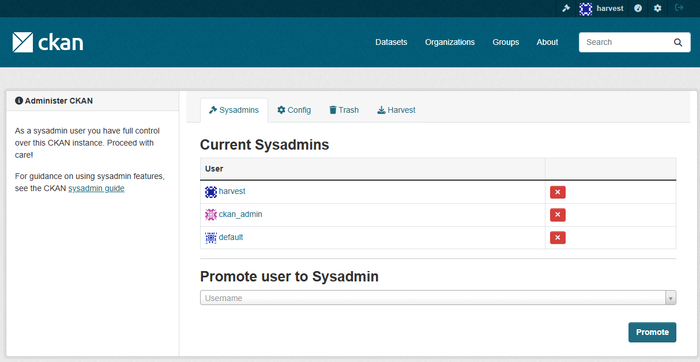
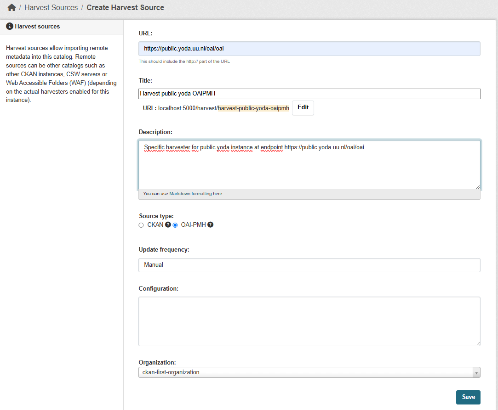
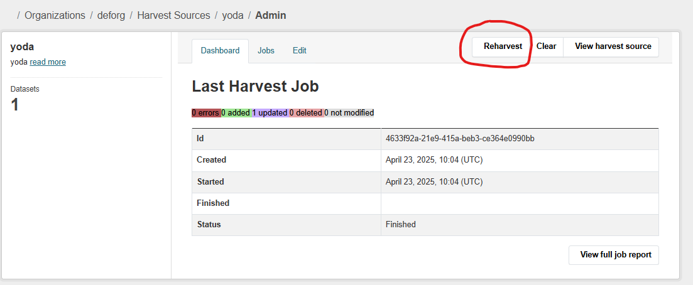

# CKAN importer for OAI-PMH endpoints


## What is the CKAN importer plugin?
The importer plugin enables CKAN to, in a very easily configurable fashion, harvest other sources based on the OAI-PMH standard in the metadata format datacite.  
It is based on a very easy-to-create configuration file, to be developed by a CKAN-maintainer, that forms the basis of directing incoming XML data into the proper CKAN schema fields.

For this to work, the following has to be in place:


## CKAN EXTENSIONS
In order for CKAN to be able to harvest external data sources extra plugins have to be added to the entire deployed CKAN instance.  

- CKANEXT-HARVEST extension  
Extension required to enable harvesting external sources

- CKANEXT-OAIPMH extension  
Enables harvesting of external data sources utilizing OAIPMH.  
Requires CKANEXT-HARVEST to be installed.

- CKANEXT-SCHEMING extension  
Enables the possibility to have CKAN have its own datastructure as defined within the schema as provided by a developer.


The extensions have to be added to the **environment file** in order to become part of the actual CKAN instance.  
It would look something like the following:

```
CKAN__PLUGINS="image_view text_view datatables_view datastore datapusher envvars harvest ckan_harvester oaipmh_harvester"
```

## CKANEXT-OAIPMH extension [CKAN HARVESTING OTHER DATA SOURCES]
The ckanext-oaipmh plugin enables oaipmh-harvesting cababilities.
It relies on ***ckan-harvest extension module*** which puts a framework into place to harvest other data sources.  
This extension builds on that framework and enables harvesting capabilites using the OAI-PMH standard.

Furthermore, this extension uses:
- xmltodict to be used to parse XML into a python dict.

- pyoai downgraded (using lxml == 4.8.0)  
https://github.com/UtrechtUniversity/ckanext-oaipmh/tree/master
as the library lxml only works with this older version.  
Only way to achieve this goal was to fork the pyoai-library into a UU-repo with the proper alterations in the code there.

This requires requirements.txt in ckanext-oaipmh to be set to:
```
# PyOAI take the one that is forked under uu-
# git+https://github.com/infrae/pyoai.git@2.5.1#egg=pyoai
git+https://github.com/UtrechtUniversity/pyoai-uu.git#egg=pyoai
```

The pyoai-uu repo has setup.py changed regarding the required lxml version as indicated here:

```
install_requires=["lxml==4.8.0", 'six'],
```

This ensures the entire combination of dependencies falls into place.


## CKAN maintainer defined configuration file
The actual operation of ckanext-oaipmh is directly driven by its configuration file.  
This defines how each field within the CKAN schema (and the SOLR schema) is filled with data coming from the XML (in datacite format).  
A detailed description can be found here ...

---------
## Preparations when software has been deployed
After deployment of the CKAN-instance several actions have to be taken on an application level.


#### Add a user 'harvest' with sysadmin rights
To add a user the following has to be done using the command line:

New user:  
  - docker compose exec ckan ckan user add admin email=admin@localhost  
  - bin/ckan user add harvest email=harvest@localhost

To set this user as a sysadmin run:

  - docker compose exec ckan ckan sysadmin add admin  
  - bin/ckan sysadmin add harvest  

This will add user 'harvest' to the sysadmin groups


#### Add (at least) one organization to CKAN
UITWERKEN


### Harvest Sources
What are harvest sources?
CKAN allows for harvesting other datasources.  
The module CKANEXT-OAIPMH makes it possible to do this in the OAIPMH-format.   
Each harvest sources defines how exactly a specific endpoint can be harvested through OAIMPH.

Given a user 'harvest' and a (default) organization , under the sysadm-settings, a new menu item 'Harvest' becomes availabe:



The addition of the new OAIPMH-module will introduce some extra screens that deal with:
- List of all known harvest sources  
- overview of all harvesting jobs and their current state
- a form that allows for a harvest source to be configured.  


#### Harvest source overview

#### Harvest source form
Creation or editing of a harvest source configuration can be done by the following form:  



In this form you can enter:

- harvest source title  
Will be used to be able in overviews. I.e. use names that are descriptive of the essence

- indicate endpoint  
For example: https://public.yoda.uu.nl/oai/oai  

- description  
A description of the actual purpose of that harvest source.

- Source type  
CKAN or OAIPMH => Choose OAIPMH

- Update frequency  
This can be set to manual as well as indicated repeating periods.

- configuration needs not be updated as it defaults to the importer functionality.

- indicate to which organization this harvest source belongs

The harvest source is now complete and can be used after saving.


#### Start the consumer queues
Harvesting consists of 2 consumers that need to be initiated:  
- bin/ckan harvester gather-consumer  
this will load a basic list of all objects that can be downloaded.   

- bin/ckan harvester fetch-consumer  
this will actually fetch each object and process it an feed it to CKAN


### Start running a harvest source
In order to bring things in motion a specific harvast source needs to be started.  
This can be an automated repetitive job (as indicated within the harvest source itself).  
A manual kickoff is possible as well.



Pressing the Reharvest button will start the harvesting-process utilizing the configuration as set within the harvest source.


#### Status of the harvest source
The plugin introduces an overview of all the harvesting sources and their current state.  


### Dynamic import configuration functionality by UU
The CKANEXT-OAIMPH plugin has been extended in such a way that the harvesting process can be highly tailored to specific needs of a situation by the person deploying.  

The CKAN-instance can be setup through an import-configuration-file that defines for any  dataset to be harvested through a specific harvest source.

which field of the harvested OAIPM-XML-output is assigned to which CKAN-field.  

In order to do so a specific syntax has been designed which can be found 'HERE'.

## Commands for administrational purposes

Above the commands can be found for docker deployed systems.  
Deploying on different systems will require a different set of commands, like below:  

New user  
```
  docker compose exec ckan ckan user add admin email=admin@localhost
  bin/ckan user add harvest email=harvest@localhost
```

To set this user as a sysadmin run
```
  docker compose exec ckan ckan sysadmin add admin
   bin/ckan sysadmin add harvest
```

To delete the 'admin' user
```
  docker compose exec ckan ckan user remove admin
```

In development mode use bin/ckan instead of docker compose exec ckan ckan for the above commands
```
bin/ckan user add harvest email=harvest@localhost
bin/ckan user add harvest2 email=harvest2@localhost

bin/ckan user sysadmin add harvest  (deze stap werkte niet!!)
```

### harvesting consumers  
Creating a harvester requires 1 organization (CREATE MANUALLY!!!)
```
bin/ckan harvester gather-consumer  
bin/ckan harvester fetch-consumer


(pyenv) $ ckan --config=/etc/ckan/default/ckan.ini harvester gather-consumer  
On another terminal, run the following command:

(pyenv) $ ckan --config=/etc/ckan/default/ckan.ini harvester fetch-consumer
Finally, on a third console, run the following command to start any pending harvesting jobs:

(pyenv) $ ckan --config=/etc/ckan/default/ckan.ini harvester run
```
